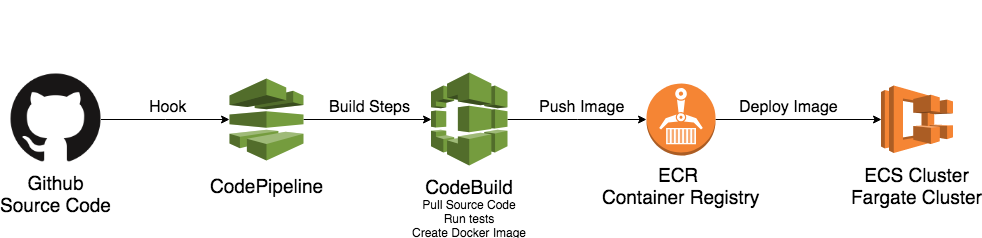

# ECS Simple Pipeline
Create environment and deployment pipelines using ECS, ECR, CodePipeline and Git with Terraform




# How to Deploy

## 1) Github Access Token

* Create your Github Access Token to Command Line. [This link have all information about this](https://help.github.com/articles/creating-a-personal-access-token-for-the-command-line/). 


* Export Github Token as an environment variable. 

```bash
export GITHUB_TOKEN=YOUR_TOKEN
``` 

2) Terraform 

* Initialize Terraform 

```bash
terraform init
```

* Plan our modifications

```bash
terraform plan
```

* Apply the changes on AWS

```bash
terraform apply
```

#### References

[Easy deploy your Docker applications to AWS using ECS and Fargate](https://thecode.pub/easy-deploy-your-docker-applications-to-aws-using-ecs-and-fargate-a988a1cc842f)
[ECS Terraform - By alex](https://github.com/alex/ecs-terraform)
[Terraform-ECS by arminc](https://github.com/arminc/terraform-ecs)
