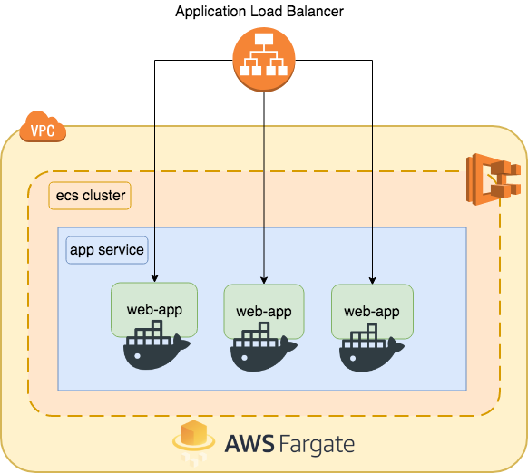

# ECS Simple Pipeline - Easy way to deploy Containers on AWS
Create environment and deployment pipelines using ECS, ECR, CodePipeline and Git with Terraform

## Architecture 



## Deploy Pipeline


# How to Deploy

## Edit your preferences

Edit `variables.tf` file to customize application preferences like Github account, repo and owner, Load Balancer ports and cluster preferences. 

```hcl
# Customize the Cluster Name
variable "cluster_name" {
  description = "ECS Cluster Name"
  default     = "web-app"
}

# Customize your ECR Registry Name
variable "app_repository_name" {
  description = "ECR Repository Name"
  default     = "web-app"
}

###### APPLICATION OPTIONS  ######
variable "container_name" {
  description = "Container app name"
  default     = "micro-api"
}
```

Edit the Github preferences in the same file to specify infos like repo, owner or organization, branches e etc. 

```hcl
# Github Repository Owner
variable "git_repository_owner" {
  description = "Github Repository Owner"
  default     = "msfidelis"
}

# Github Repository Project Name
variable "git_repository_name" {
  description = "Project name on Github"
  default     = "micro-api"
}

# Default Branch
variable "git_repository_branch" {
  description = "Github Project Branch"
  default     = "master"
}
```

## Edit your Build steps

This demo build, dockerize and deploy a simple Node.JS application. Customize your build steps on `modules/pipeline/templates/buildspec.yml` file. 


## How to Deploy

### 1) Github Access Token

* Create your Github Access Token to Command Line. [This link have all information about this](https://help.github.com/articles/creating-a-personal-access-token-for-the-command-line/). 


* Export Github Token as an environment variable. 

```bash
export GITHUB_TOKEN=YOUR_TOKEN
``` 

### 2) Terraform 

* Initialize Terraform 

```bash
terraform init
```

* Plan our modifications

```bash
terraform plan
```

* Apply the changes on AWS

```bash
terraform apply
```

#### References

* [Easy deploy your Docker applications to AWS using ECS and Fargate](https://thecode.pub/easy-deploy-your-docker-applications-to-aws-using-ecs-and-fargate-a988a1cc842f)

* [ECS Terraform - By alex](https://github.com/alex/ecs-terraform)

* [Terraform-ECS by arminc](https://github.com/arminc/terraform-ecs)
